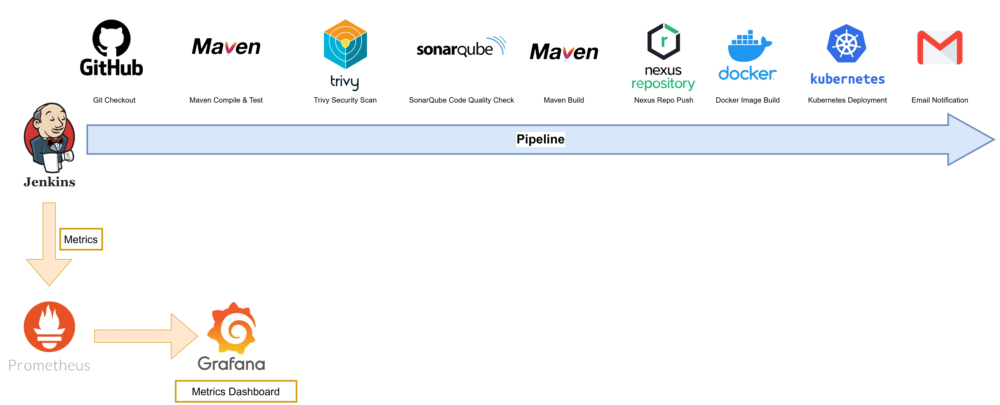
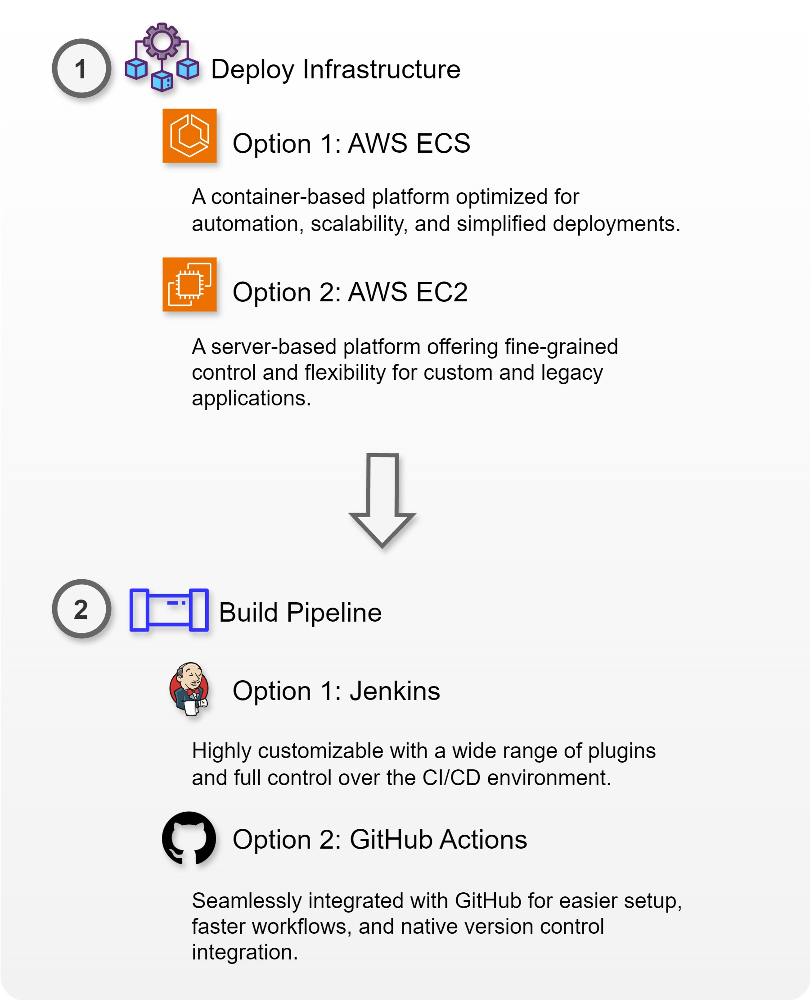
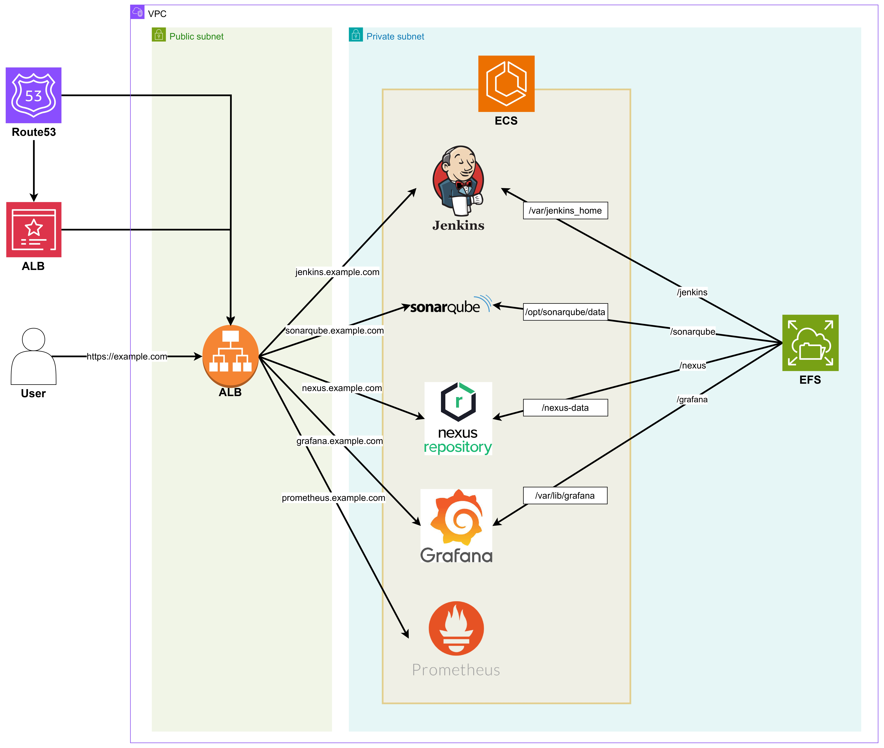

# Corporate Level DevOps Pipeline Project



---

## Table of Contents

- [1) Deploy Infrastructure](#1-deploy-infrastructure)
  - [ECS version](#ecs-version)
  - [EC2 version](#ec2-version)
- [2) Deploy Pipeline](#2-deploy-pipeline)
  - [Jenkins version](#jenkins-version)
  - [GitHub Actions version](#github-actions-version)
- [3) Set up Monitoring](#4-set-up-monitoring)
  - [Install Prometheus (Port 9090)](#install-prometheus-port-9090)
  - [Install Prometheus - Blackbox Exporter (Port 9115)](#install-prometheus---blackbox-exporter-port-9115)
  - [Install Grafana (Port 3000)](#install-grafana-port-3000)
  - [System performance metrics](#system-performance-metrics)

<br>
<br>

Credit to jaiswaladi246
https://youtu.be/NnkUGzaqqOc?si=-5ugADFn6lgBzpK9

---


---

# 1) Deploy Infrastructure

Deploy infrastructure using **ECS version** or **EC2 version**.

## ECS version

[ECS version](https://github.com/dongwon-lee-dev/terraform-devops-pipeline)



## EC2 version

[EC2 version](ec2-version.md)

---

# 2) Deploy Pipeline
Deploy pipeline using **Jenkins version** or **GitHub Actions version**.


## Jenkins version

[Jenkins version](jenkins.md)


## GitHub Actions version

[GitHub Actions version](github-actions-version.md)

---

# 3) Set up Monitoring

## Configure Prometheus
1. Add to prometheus-2.53.2.linux-amd64/prometheus.yml

\* In case of Raspberry Pi, edit /etc/prometheus/prometheus.yml

```yaml
scrape_configs:
  - job_name: 'blackbox'
    metrics_path: /probe
    params:
      module: [http_2xx]  # Look for a HTTP 200 response.
    static_configs:
      - targets:
        - http://prometheus.io    # Target to probe with http.
        - http://[Kubernetes worker node ip address]:30898
    relabel_configs:
      - source_labels: [__address__]
        target_label: __param_target
      - source_labels: [__param_target]
        target_label: instance
      - target_label: __address__
        replacement: [Monitoring Instance ip address]:9115  # The blackbox exporter's real hostname:port.
```

2. Restart Promethius

```bash
pgrep prometheus
kill [pid]
./prometheus &
```

```bash
# Raspberry Pi
sudo systemctl restart prometheus
```

## Configure Grafana

1. Create Grafana Dashboard: admin admin
2. Home > Connections > Data sources > prometheus - Connections - Data sources - Connection Prometheus server URL: http://[ip address]:9090
   - Change whenever the monitor instance ip address changes
3. Click on the top right + Import Dashboard 7587 Load, signcl-prometheus: prometheus - Import

## How to connect Jenkins to Prometheus

1.Jenkins plugin: prometheus metrics 
2. Jenkins server: install Node Exporter (9100)

```bash
wget https://github.com/prometheus/node_exporter/releases/download/v1.8.2/node_exporter-1.8.2.linux-amd64.tar.gz
tar -xvf node_exporter-1.8.2.linux-amd64.tar.gz
cd node_exporter-1.8.2.linux-amd64.tar.gz
./node_exporter &
```

```bash
# Raspberry pi
sudo apt install prometheus-node-exporter
sudo ufw allow 9100
```

3. Jenkins - System - Prometheus configuration default

4. Monitoring server - prometheus.yml add

```yaml
scrape_configs:
  - job_name: "node_exporter"
    static_configs:
      - targets: ["[jenkins server ip]:9100"]
  - job_name: "jenkins"
    metrics_path: "/prometheus"
    static_configs:
      - targets: ["[jenkins server ip]:8080"]
```

5. Restart Promethius

```bash
pgrep prometheus
kill [pid]
./prometheus &
```

6. Create a Grafana dashboard: Click on the top right + Import Dashboard 1860 & 9964 Load, signcl-prometheus: prometheus - Import