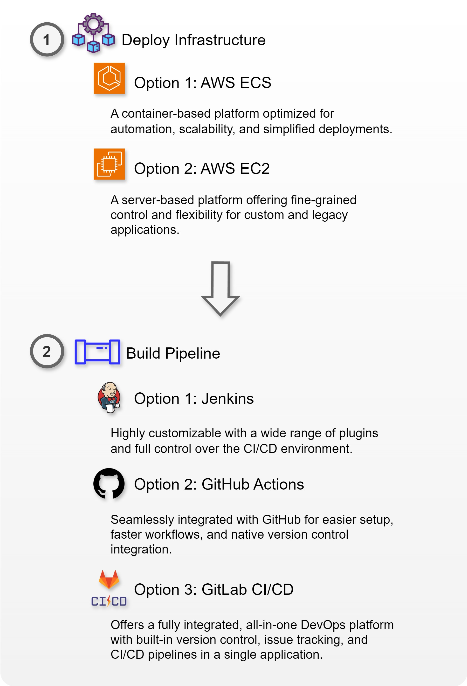

# Corporate Level DevOps Pipeline Project

---

## Table of Contents

- [1) Deploy Infrastructure](#1-deploy-infrastructure)
  - [ECS version](#ecs-version)
  - [EC2 version](#ec2-version)
- [2) Deploy Pipeline](#2-deploy-pipeline)
  - [Jenkins version](#jenkins-version)
  - [GitHub Actions version](#github-actions-version)
  - [GitLab CI/CD version](#gitlab-cicd-version)
- [3) Set up Monitoring](#3-set-up-monitoring)
  - [ECS Version](#ecs-version)
  - [EC2 Version](#ec2-version)

---

---

# 1) Deploy Infrastructure

Deploy infrastructure using **ECS version** or **EC2 version**.

## ECS version

[ECS version](https://github.com/dongwon-lee-dev/terraform-devops-pipeline)

## EC2 version

[EC2 version](ec2-version.md)

---

# 2) Deploy Pipeline
Deploy pipeline using **Jenkins version** or **GitHub Actions version**.

## Jenkins version

[Jenkins version](jenkins.md)

## GitHub Actions version

[GitHub Actions version](github-actions-version.md)

## GitLab CI/CD version

[GitLab CI/CD version](gitlab-cicd-version.md)

---

# 3) Set up Monitoring

## ECS Version
[ECS version](ecs-monitoring.md)

## EC2 Version
[EC2 version](ec2-monitoring.md)