# ECS version Monitoring

[To Home](README.md)

---

## Table of Contents

- [Configure Prometheus](#configure-prometheus)  
- [Configure Grafana](#configure-grafana)   

---

## Configure Prometheus

1. Configure application to export metrics (Spring Boot app)
- **pom.xml**
```
    <dependency>
      <groupId>io.micrometer</groupId>
      <artifactId>micrometer-registry-prometheus</artifactId>
    </dependency>
    <dependency>
      <groupId>org.springframework.boot</groupId>
      <artifactId>spring-boot-starter-actuator</artifactId>
    </dependency>
```
- **src/main/resources/application.properties**
```
management.endpoints.web.exposure.include=prometheus
management.metrics.export.prometheus.enabled=true
```

2. Deploy Application ECS Service with **Service Connect** enabled
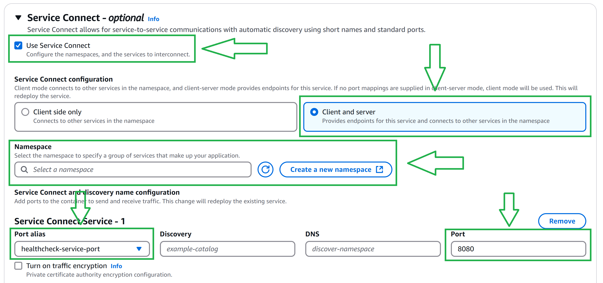

3. Check Application ECS Service's **Client alias DNS:port**
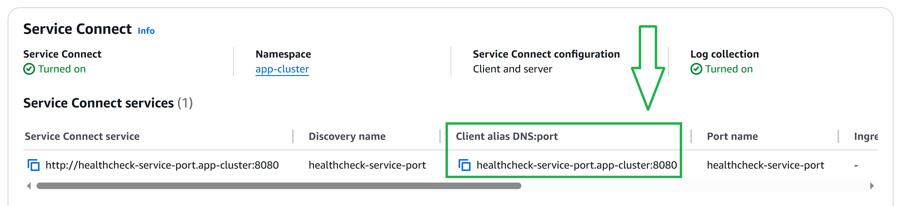

4. Create a custom Prometheus image
- **prometheus.yml**: Input **Client aliass DNS:port**
```
global:
  scrape_interval: 15s

scrape_configs:
  - job_name: 'spring-app'
    metrics_path: /actuator/prometheus
    static_configs:
      - targets: [<Client alais DNS:port>]
```
- **Dockerfile**
```
FROM bitnami/prometheus
COPY prometheus.yml /etc/prometheus/prometheus.yml
```
Configuration and networking

5. Deploy Prometheus ECS Service with **Service Connect** enabled
- Use the same namespace as the application's namespace.

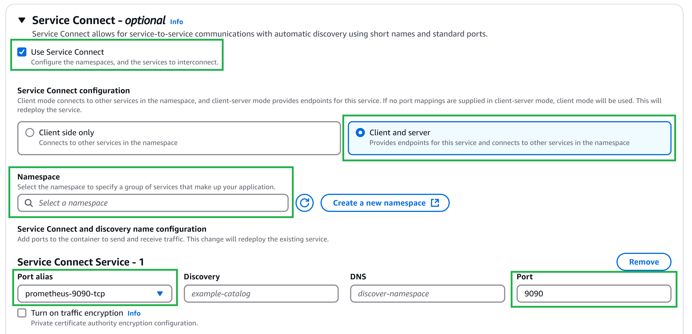

6. Check Prometheus  

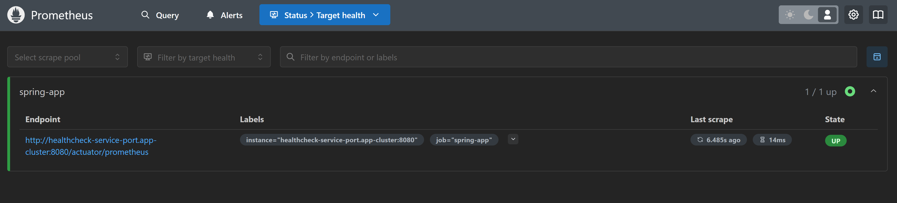

---

## Configure Grafana
1. Deploy Grafana ECS Service with **Service Connect** enabled
- Use the same namespace as the prometheus' namespace.

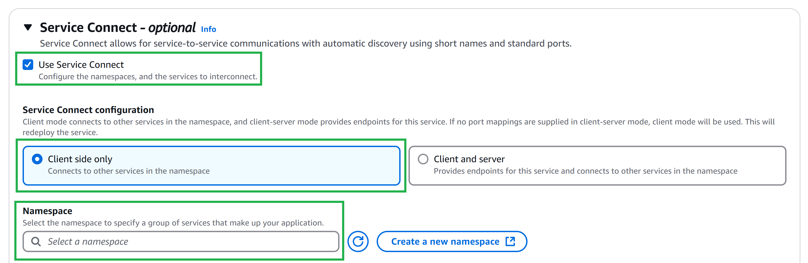

2. Initialize Grafana 
  - default username: admin  
  - default password: admin

3. Add Prometheus Data Source
- Prometheus source: Input Prometheus ECS Service's **Service connect service**

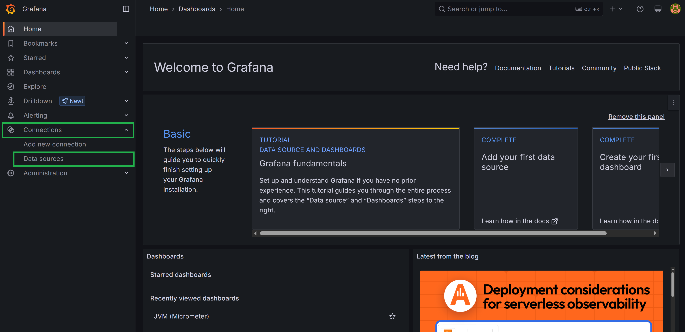
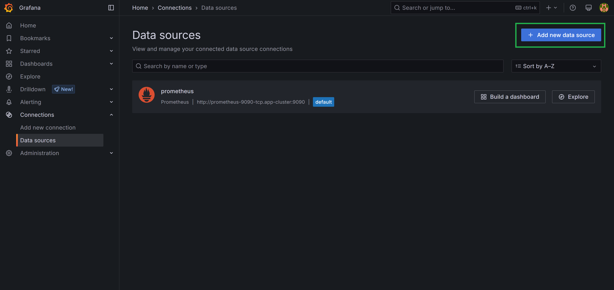
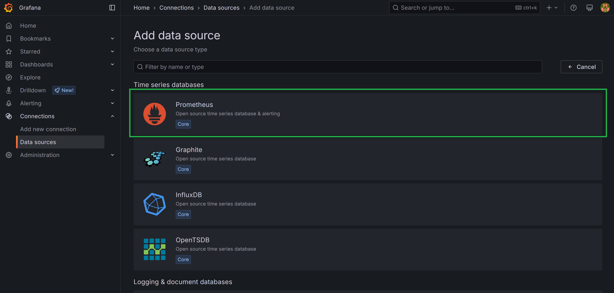
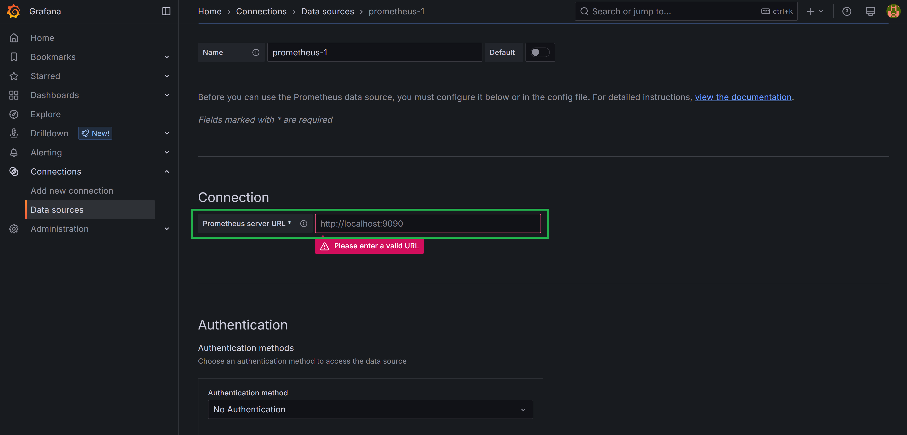
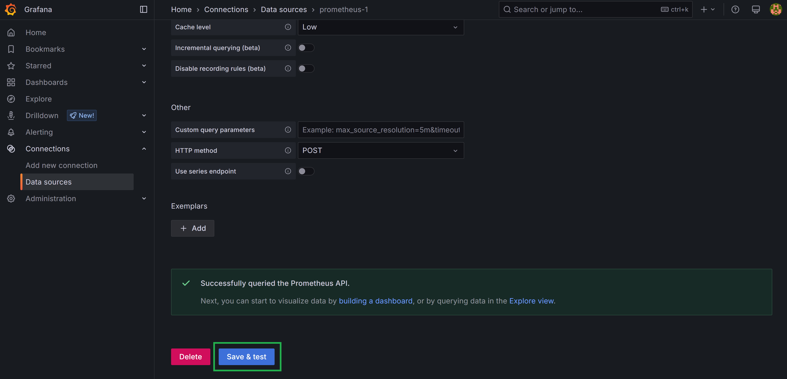

4. Create a Dashboard
- Dashboard ID: 4701

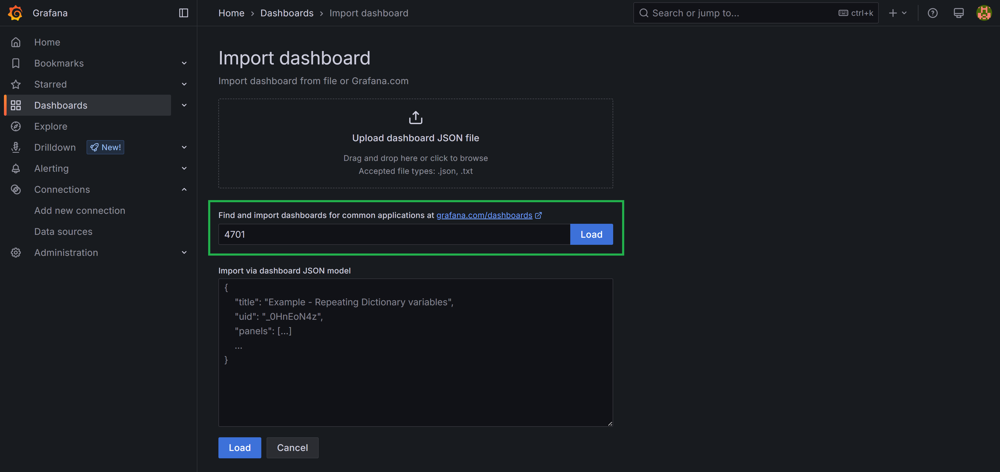
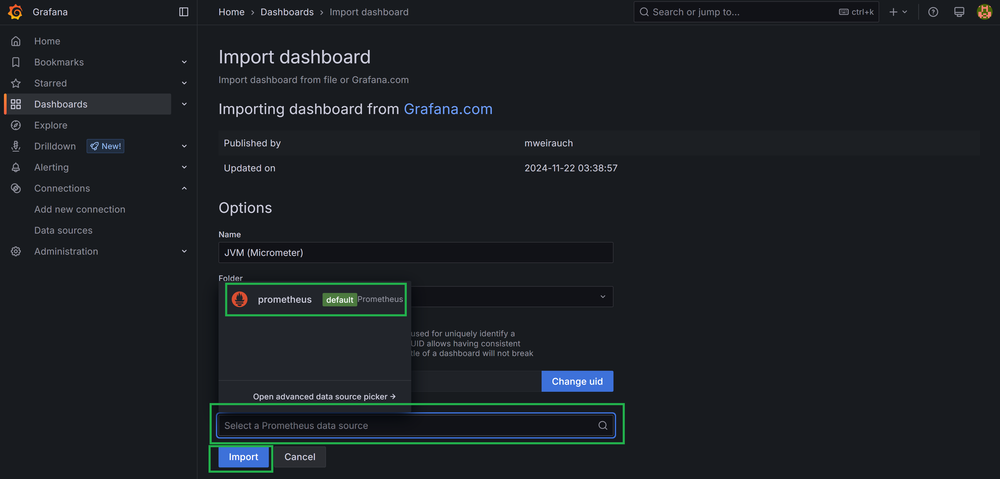
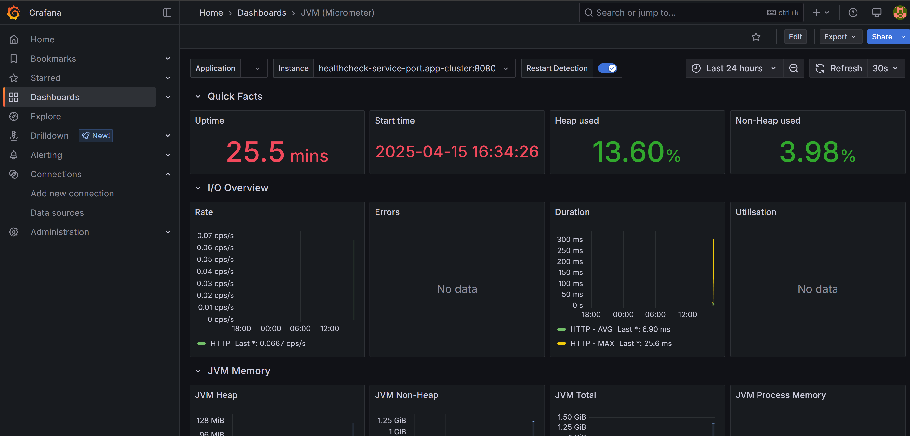


---

[To Home](README.md)
