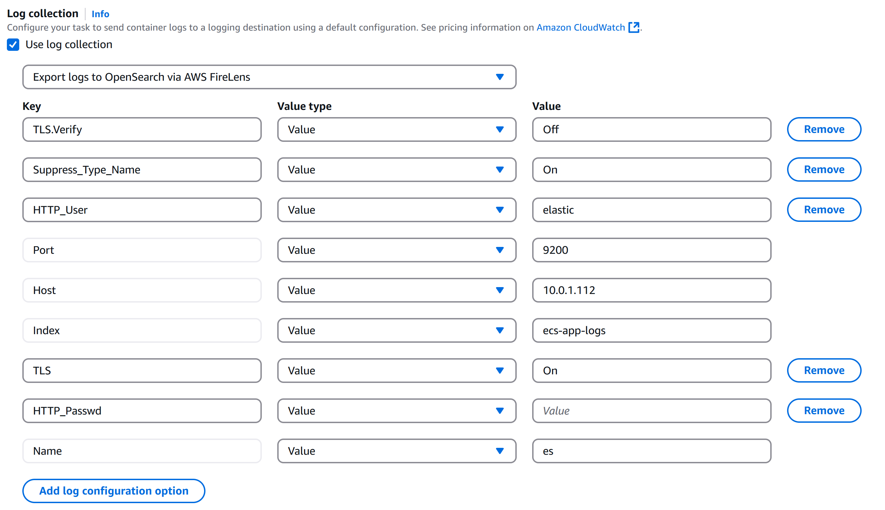
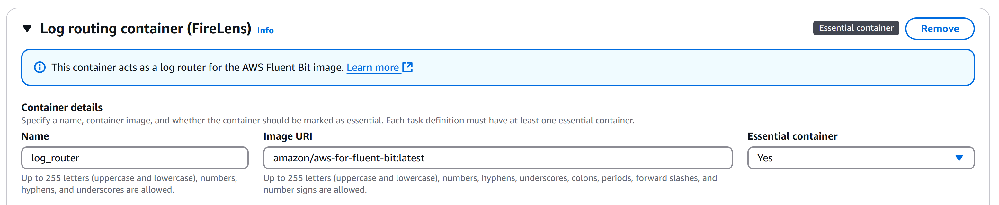
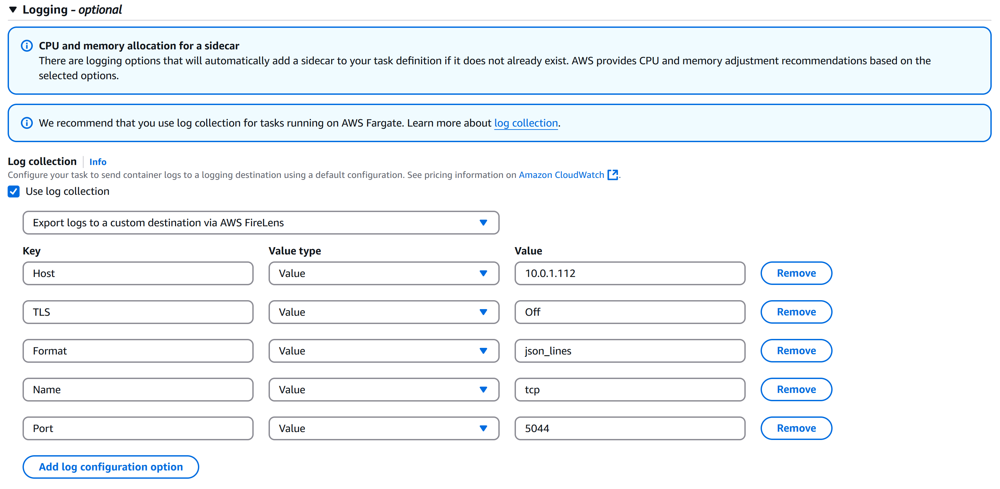
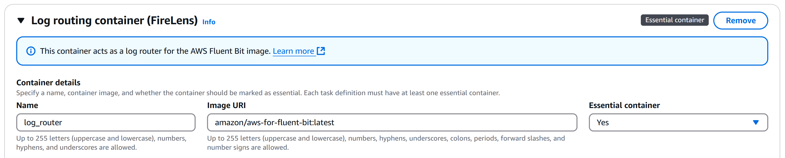

# ELK

[To Home](README.md)

---

## Table of Contents
- [1) Install ELK](#1-install-elk)
  - [1.1) Install ELK](#1-install-elk)
  - [1.2) Configure Kibana](#2-configure-kibana)
  - [1.3) Start ELK Services](#3-start-elk)
  - [1.4) Initialize Kibana (port 5601)](#4-initialize-kibana-port-5601)
- [2) ECS FireLens + Fluent Bit](#2-ecs-firelens--fluent-bit)
  - [2.1) ECS Log → Elasticsearch (port 9200)](#1-ecs-log---elasticsearch-port-9200-simple-log-routing)
  - [2.2) ECS Log → Logstash (port 5044)](#2-ecs-log---logstash-port-5044-log-filtering-and-processing)
- [3) Logstash Log Processing](#3-logstash-log-processing)

---


## 1) Install ELK

### 1. Install ELK
```
sudo rpm --import https://artifacts.elastic.co/GPG-KEY-elasticsearch

cat <<EOF | sudo tee /etc/yum.repos.d/elasticsearch.repo
[elasticsearch]
name=Elasticsearch repository for 8.x packages
baseurl=https://artifacts.elastic.co/packages/8.x/yum
gpgcheck=1
gpgkey=https://artifacts.elastic.co/GPG-KEY-elasticsearch
enabled=0
autorefresh=1
type=rpm-md
EOF

cat <<EOF | sudo tee /etc/yum.repos.d/logstash.repo
[logstash-8.0]
name=Elastic repository for 8.0 packages
baseurl=https://artifacts.elastic.co/packages/8.0/yum
gpgcheck=1
gpgkey=https://artifacts.elastic.co/GPG-KEY-elasticsearch
enabled=1
autorefresh=1
type=rpm-md
EOF

cat <<EOF | sudo tee /etc/yum.repos.d/kibana.repo
[kibana-8.x]
name=Kibana repository for 8.x packages
baseurl=https://artifacts.elastic.co/packages/8.x/yum
gpgcheck=1
gpgkey=https://artifacts.elastic.co/GPG-KEY-elasticsearch
enabled=1
autorefresh=1
type=rpm-md
EOF

sudo yum install --enablerepo=elasticsearch elasticsearch -y
sudo yum install logstash kibana -y
```

### 2. Configure Kibana 
```
sudo vi /etc/kibana/kibana.yml
```

```
server.host: "0.0.0.0"
```

### 3. Start ELK

```
sudo systemctl enable --now elasticsearch
sudo systemctl enable --now logstash
sudo systemctl enable --now kibana
```

### 4. Initialize Kibana (port 5601) 
- Get Kibana's Elasticsearch enrollment token
```
sudo /usr/share/elasticsearch/bin/elasticsearch-create-enrollment-token -s kibana

```
- Get Kibana's Elasticsearch verification code
```
sudo /usr/share/kibana/bin/kibana-verification-code
```
- Kibana inital username: elastic
- Get Kibana initial password
```
sudo /usr/share/elasticsearch/bin/elasticsearch-reset-password -u elastic
```
---

## 2) ECS FireLens + Fluent Bit

- FireLens: AWS log router that integrates Fluent Bit into ECS tasks for custom log routing.
- Fluent Bit: Lightweight log processor and forwarder that collects, filters, and routes logs.

### 1. ECS Log -> Elasticsearch port 9200 (Simple Log Routing)
1. Kibana: create Index 'ecs-app-logs'
2. Deploy application ECS service with FireLens and FluentBit side container

```
{
    "containerDefinitions": [
        {
            "name": "healthcheck-service",
            "image": <Image URI>,
            "cpu": 256,
            "memory": 512,
            "portMappings": [
                {
                    "name": "healthcheck-service-port",
                    "containerPort": 8080,
                    "hostPort": 8080,
                    "protocol": "tcp",
                    "appProtocol": "http"
                }
            ],
            "essential": true,
            "environment": [],
            "mountPoints": [],
            "volumesFrom": [],
            "logConfiguration": {
                "logDriver": "awsfirelens",
                "options": {
                    "TLS.Verify": "Off",
                    "Suppress_Type_Name": "On",
                    "HTTP_User": "elastic",
                    "Port": "9200",
                    "Host": <Elasticsearch host>,
                    "Index": "ecs-app-logs",
                    "TLS": "On",
                    "HTTP_Passwd": <Elasticsearch password>,
                    "Name": "es"
                },
                "secretOptions": []
            },
            "systemControls": []
        },
        {
            "name": "log_router",
            "image": "amazon/aws-for-fluent-bit:latest",
            "cpu": 256,
            "memoryReservation": 50,
            "portMappings": [],
            "essential": true,
            "environment": [],
            "mountPoints": [],
            "volumesFrom": [],
            "user": "0",
            "logConfiguration": {
                "logDriver": "awslogs",
                "options": {
                    "awslogs-group": "/ecs/healthcheck-service",
                    "mode": "non-blocking",
                    "awslogs-create-group": "true",
                    "max-buffer-size": "25m",
                    "awslogs-region": "us-east-1",
                    "awslogs-stream-prefix": "ecs"
                },
                "secretOptions": []
            },
            "systemControls": [],
            "firelensConfiguration": {
                "type": "fluentbit",
                "options": {
                    "enable-ecs-log-metadata": "true"
                }
            }
        }
    ]
}
```

**Main container log collection**

**Side container**


### 2. ECS Log -> Logstash port 5044 (Log Filtering and Processing)

1. Kibana: create Index 'ecs-app-logs'
2. Deploy application ECS service with FireLens and FluentBit side container

```
{
    "containerDefinitions": [
        {
            "name": "healthcheck-service",
            "image": <Image URI>,
            "cpu": 256,
            "memory": 512,
            "portMappings": [
                {
                    "name": "healthcheck-service-port",
                    "containerPort": 8080,
                    "hostPort": 8080,
                    "protocol": "tcp",
                    "appProtocol": "http"
                }
            ],
            "essential": true,
            "environment": [],
            "mountPoints": [],
            "volumesFrom": [],
            "logConfiguration": {
                "logDriver": "awsfirelens",
                "options": {
                    "Host": <Logstash host>,
                    "TLS": "Off",
                    "Format": "json_lines",
                    "Name": "tcp",
                    "Port": "5044"
                }
            },
            "systemControls": []
        },
        {
            "name": "log_router",
            "image": "amazon/aws-for-fluent-bit:latest",
            "cpu": 256,
            "memoryReservation": 50,
            "portMappings": [],
            "essential": true,
            "environment": [],
            "mountPoints": [],
            "volumesFrom": [],
            "user": "0",
            "logConfiguration": {
                "logDriver": "awslogs",
                "options": {
                    "awslogs-group": "/ecs/healthcheck-service",
                    "mode": "non-blocking",
                    "awslogs-create-group": "true",
                    "max-buffer-size": "25m",
                    "awslogs-region": "us-east-1",
                    "awslogs-stream-prefix": "ecs"
                }
            },
            "systemControls": [],
            "firelensConfiguration": {
                "type": "fluentbit",
                "options": {
                    "enable-ecs-log-metadata": "true"
                }
            }
        }
    ]
}
```

**Main container log collection**

**Side container**


3. Configure Logstash
```
sudo vi /etc/logstash/conf.d/logstash.conf
```

```
input {
  tcp {
    port => 5044
    codec => json_lines
  }
}

output {
  elasticsearch {
    hosts => ["https://localhost:9200"]
    index => "ecs-app-logs"
    user => "elastic"
    password => <Elasticsearch Password>
    ssl => true
    ssl_certificate_verification => false
  }
}

```
- After appying SSL certification to Elasticsearch remove 'ssl_certificate_verification => false'

```
sudo systemctl restart logstash
```


---

## 3) Logstash Log Processing
```
sudo vi /etc/logstash/conf.d/logstash.conf
```

```
input {
  # Receive logs (e.g., HTTP, Beats, TCP, etc.)
}

filter {
  # Preprocessing and filtering (e.g., grok, mutate, json, etc.)
}

output {
  # Send logs to destination (e.g., Elasticsearch, S3, stdout, etc.)
}
```

---

[To Home](README.md)