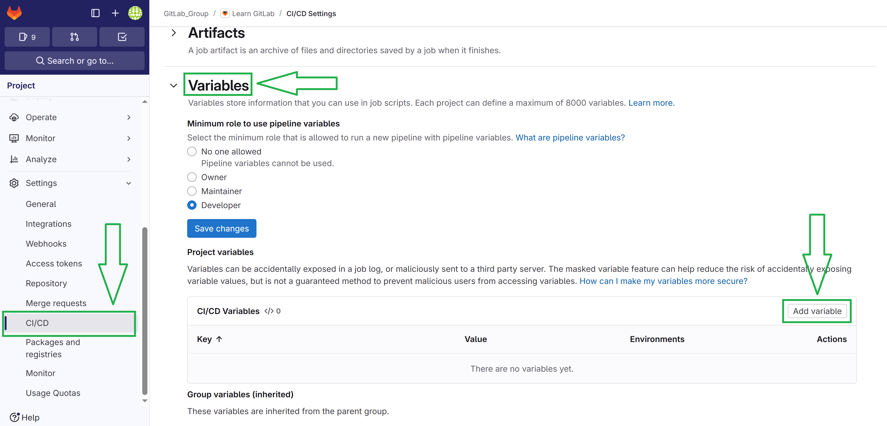
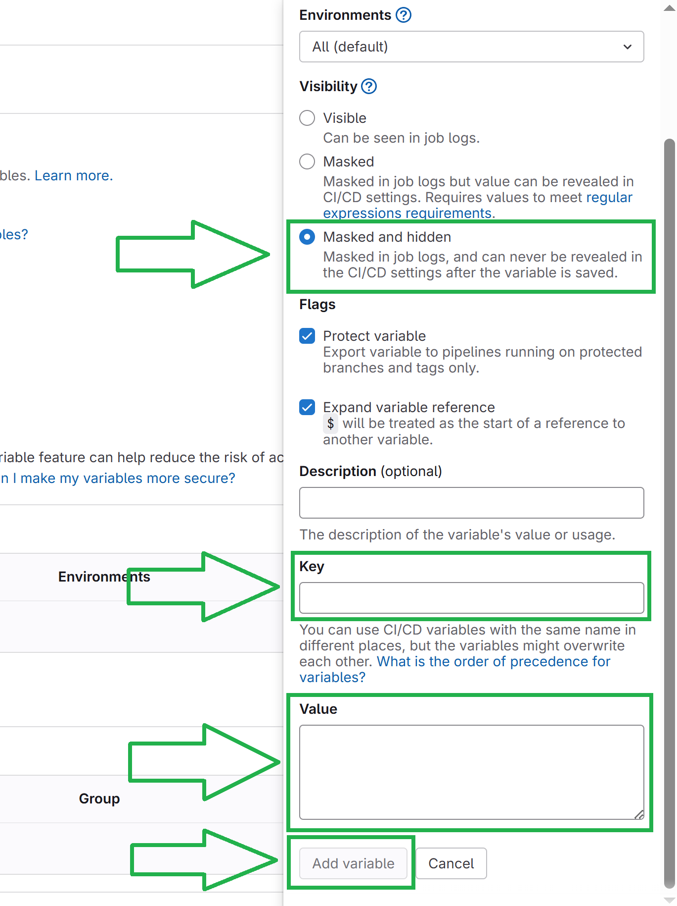

# GitLab CICD version Pipeline
[To Home](README.md)

---

## Table of Contents
[1. Create Secrets](#1-create-secrets)  
[2. Create a Pipeline](#2-create-a-pipeline)  
[3. SonarQube Code Quality Check](#3-sonarqube-code-quality-check)  
[4. SonarQube Quality Gate Check](#4-sonarqube-quality-gate-check)  
[5. Push Artifact to Nexus Repository](#5-push-artifact-to-nexus-repository)  
[6. Build Docker Image](#6-build-docker-image)  
[7. Trivy Security Scan](#7-trivy-security-scan)  
[8. Push to AWS ECR (Elastic Container Registry)](#9-push-to-aws-ecrelastic-container-registry)  
[9. Deploy To AWS ECS (Elastic Container Service)](#0-deploy-to-aws-ecselastic-container-service)

---

### 1. Create Secrets
1. AWS_ACCESS_KEY_ID
2. AWS_SECRET_ACCESS_KEY
3. SONAR_HOST_URL
4. SONAR_TOKEN
5. MAVEN_USERNAME
6. MAVEN_PASSWORD



---

### 2. Create a Pipeline
1. Create a pipeline file on project root folder: /.gitlab-ci.yml
```
stages:
  - sonarqube
  - quality-gate
  - nexus
  - docker
  - scan
  - push
  - deploy

default:
  image: docker:24.0.5
  services:
    - docker:24.0.5-dind

variables:
  DOCKER_TLS_CERTDIR: ""
  DOCKER_IMAGE: "healthcheck-service"
  SONAR_USER_HOME: "${CI_PROJECT_DIR}/.sonar"  
  GIT_DEPTH: "0" 

cache:
  paths:
    - .m2/repository
```

### 3. SonarQube Code Quality Check
```
sonarqube-check:
  stage: sonarqube
  image: maven:3.9-eclipse-temurin-17 
  script:
    - mvn clean verify sonar:sonar
      -Dsonar.projectKey=healthcheck-service
      -Dsonar.host.url=$SONAR_HOST_URL
      -Dsonar.login=$SONAR_TOKEN
  allow_failure: false
```

### 4. SonarQube Quality Gate Check
```
check-quality-gate:
  stage: quality-gate
  image: alpine/curl
  before_script:
    - apk add --no-cache jq
  script:
    - STATUS=$(curl -s -u "$SONAR_TOKEN:" "$SONAR_HOST_URL/api/qualitygates/project_status?projectKey=healthcheck-service" | jq -r '.projectStatus.status')
    - echo "Quality Gate Status - $STATUS"
    - if [ "$STATUS" != "OK" ]; then echo "Quality Gate failed"; exit 1; fi
```

### 5. Push Artifact to Nexus Repository
1. pom.xml 
2. settings.xml
```
nexus-push:
  stage: nexus
  image: maven:3.9-eclipse-temurin-17
  script:
    - mvn clean compile
    - echo "Creating Maven settings.xml"
    - mkdir -p ~/.m2
    - |
      cat <<EOF > ~/.m2/settings.xml
      <settings xmlns="http://maven.apache.org/SETTINGS/1.0.0"
                xmlns:xsi="http://www.w3.org/2001/XMLSchema-instance"
                xsi:schemaLocation="http://maven.apache.org/SETTINGS/1.0.0 https://maven.apache.org/xsd/settings-1.0.0.xsd">
        <servers>
          <server>
            <id>maven-release</id>
            <username>${MAVEN_USERNAME}</username>
            <password>${MAVEN_PASSWORD}</password>
          </server>
          <server>
            <id>maven-snapshot</id>
            <username>${MAVEN_USERNAME}</username>
            <password>${MAVEN_PASSWORD}</password>
          </server>
        </servers>
      </settings>
      EOF
    - mvn --batch-mode deploy
  only:
    - main
  variables:
    MAVEN_USERNAME: $MAVEN_USERNAME
    MAVEN_PASSWORD: $MAVEN_PASSWORD
```

### 6. Build Docker Image
```
docker_build:
  stage: docker
  script:
    - docker build -t $DOCKER_IMAGE .
    - docker save $DOCKER_IMAGE:latest -o image.tar
  artifacts:
    paths:
      - image.tar
    expire_in: 1 hour
```

### 7. Trivy Security Scan
```
trivy_scan:
  stage: scan
  before_script:
    - apk update
    - apk add --no-cache curl
    - curl -sfL https://raw.githubusercontent.com/aquasecurity/trivy/main/contrib/install.sh | sh -s -- -b /usr/local/bin
    - docker load -i image.tar
    - docker images
  script:
    - trivy image --download-db-only
    - trivy image --format json --output trivy-report.json $DOCKER_IMAGE:latest
  artifacts:
    paths:
      - trivy-report.json
```

### 8. Push to AWS ECR(Elastic Container Registry)
Create an ECR private repository with name [docker image].
Use ecr-credential-helper to secure secrets.
```
ecr_push:
  stage: push
  before_script:
    - apk add --no-cache curl
    - curl -Lo /usr/local/bin/docker-credential-ecr-login https://amazon-ecr-credential-helper-releases.s3.us-east-2.amazonaws.com/0.9.1/linux-amd64/docker-credential-ecr-login
    - chmod +x /usr/local/bin/docker-credential-ecr-login
    - mkdir -p ~/.docker
    - |
      cat <<EOF > ~/.docker/config.json
      {
        "credsStore": "ecr-login"
      }
      EOF
    - docker load -i image.tar
  script:
    - docker tag $DOCKER_IMAGE:latest 088351136602.dkr.ecr.us-east-1.amazonaws.com/$DOCKER_IMAGE:latest
    - docker push 088351136602.dkr.ecr.us-east-1.amazonaws.com/$DOCKER_IMAGE:latest
```

### 9. Deploy To AWS ECS(Elastic Container Service)
1. Create a task definition that pulls image from ECR.
2. Create a ECS service with the created task definition
3. Force redeploy the ECS service to make it use the latest image.
```
ecs_deploy:
  stage: deploy
  image: amazon/aws-cli
  script:
    - aws ecs update-service  --region us-east-1 --cluster app-cluster --service healthcheck-service --force-new-deployment
```

---

[To Home](README.md)
