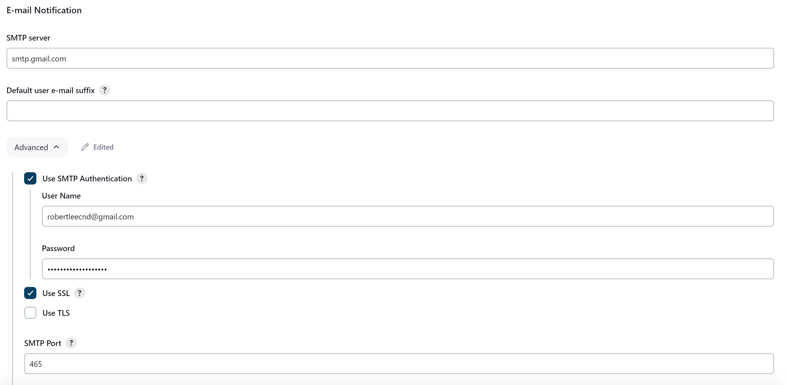
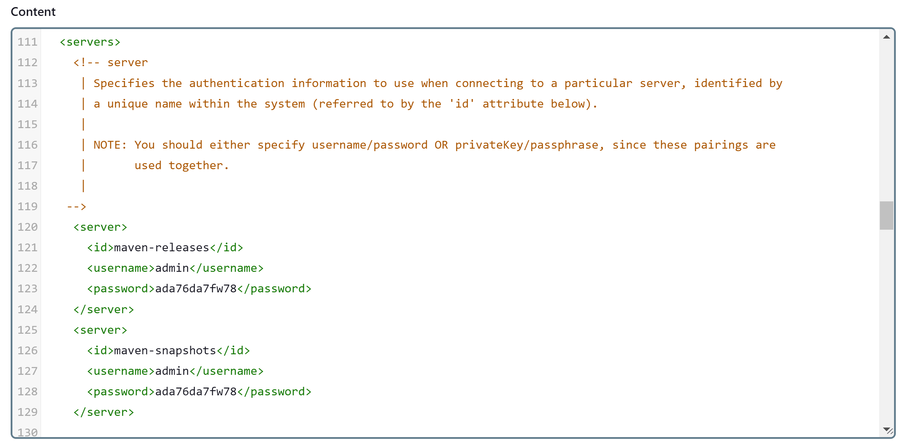

# Jenkins
[To Home](README.md)

---

## Table of Contents
- [1) Configure Jenkins ](#1-configure-jenkins)
  - [1. Install Jenkins plugins](#1-install-jenkins-plugins)
  - [2. Configure Jenkins Tools](#2-configure-jenkins-tools)
  - [3. Configure Jenkins Credentials](#3-configure-jenkins-credentials)
- [2) Pipeline Components](#2-pipeline-components)
  - [Pull from Git Repository](#pull-from-git-repository)
  - [Run AWS Commands](#run-aws-commands)
  - [Send a Notification Email](#send-a-notification-email)
- [3) Full Pipeline](#3-full-pipeline)

---

# 1) Configure Jenkins

### 1. Install Jenkins plugins

<table>
  <tr>
    <th colspan="5" style="background-color: lightgray;">Jenkins Plugins</th>
  </tr>
  <tr>
    <td>JDK</td>
    <td>eclipse temurin installer </td>
  </tr>
  <tr>
    <td>Maven</td>
    <td>config file provider, maven integration, pipeline maven integration</td>
  </tr>
  <tr>
    <td>SonarQube</td>
    <td>sonarqube scanner </td>
  </tr>
    <tr>
    <td>Docker</td>
    <td>Docker, Docker Pipeline</td>
  </tr>
    <tr>
    <td>Kubernetes</td>
    <td>kubernetes, kuberntes cli, kubernetes client api, kubernetes credentials</td>
  </tr>
      <tr>
    <td>Prometheus</td>
    <td>Prometheus Metrics Plugin</td>
  </tr>
</table>

### 2. Configure Jenkins Tools

Manage Jenkins - Tools

- JDK installations
- Maven installations
- SonarQube Scanner installations
- Docker installations


### 3. Configure Jenkins Credentials

<table>
    <tr>
    <th>Credential ID</th>
    <th>Description</th>
  </tr>
  <tr>
    <td>sonar-cred (Secret text)</td>
    <td>SonarQube - Administration - Configuration - Users - Tokens</td>
  </tr>
  <tr>
    <td>github-cred (Username with password)</td>
    <td>Github username and token</td>
  </tr>
  <tr>
    <td>docker-cred (Username with password)</td>
    <td>Docker hub username and password</td>
  </tr>
  <tr>
    <td>k8-cred (Secret text)</td>
    <td>kubectl describe secret mysecretname -n webapps</td>
  </tr>
    <tr>
    <td>mail-cred (Username with password)</td>
    <td>Gmail App Password</td>
  </tr>
  </tr>
    <tr>
    <td>aws-cred (AWS Credential)</td>
    <td>AWS IAM Dashboard</td>
  </tr>
</table>

---

# 2) Pipeline Components

### Pull from Git Repository

```
steps {
  git branch: 'main', url: '[Repository URL]'
}
```

### Run AWS Commands

```
steps {
  withCredentials([
      [
        $class: 'AmazonWebServicesCredentialsBinding',
        credentialsId: 'aws-cred',
        accessKeyVariable: 'AWS_ACCESS_KEY_ID',
        secretKeyVariable: 'AWS_SECRET_ACCESS_KEY'
      ]
  ]) {
    sh '[AWS Commands]'
  }
}
```

### Send a Notification Email

1. **Create Recipient Gmail App Password**: Manage your Google Account - Security - 2-Step Verification - App passwords
2. **Jenkins SMTP server configuration**: Manage Jenkins - System - E-mail Notification & Extended E-mail notification




```
post {
  always {
    script {
      def body = [Email Body]

      emailext (
          subject: [Email Subject],
          body: body,
          to: [Recipient],
          from: 'jenkins@example.com',
          replyTo: 'jenkins@example.com',
          mimeType: 'text/html',
          attachmentsPattern: [File to Attach]
      )
    }
  }
}
```
---

# 3) Full Pipeline

Refer to /Jenkinsfile.

Steps
1. Git Pull (GitHub)
2. Compile (Maven)
3. Test (Maven)
4. File System Scan (Trivy)
5. SonarQube Analysis (SonarQube)
   1. Create **SonarQube Token**: SonarQube - Administration - Security - Users - Administrator: Tokens - Generate Tokens - Copy the token and save it somewhere
   2. Create Jenkins **SonarQube Credential**: Jenkins Credentials - create sonar-cred (Secret text) with the token
   3. Configure **Jenkins System**: Jenkins System - SonarQube installations - sonarqube / server url / sonar-cred
   4. **Register 3rd party tool in pipeline**: environment { }
6. Quality Gate (SonarQube)
   1. **Register Webhook on SonarQube**: SonarQube - Administration - Configuration - Webhooks - Name: jenkins, URL: [Jenkins URL]/sonarqube-webhook/
7. Build (Maven)
8. Publish To Nexus (Nexus) 1. Nexus maven-releases, maven-snapshots URL -> Boardgame/pom.xml 2. Jenkins - Managed files - Add a new Config - Global Maven settings.xml / ID: global-settings - <server> - maven-releases / maven-snapshots


9. Build & Tag Docker Image (Docker)
10. Docker Image Scan (Docker)
11. Push Docker Image (Docker)
12. Deploy To Kubernetes (Kubernetes)
    - Create Service Account, Role, Binding in Kubernetes Cluster
    - Create Secret in Kubernetes Cluster webapps namespace (kubectl apply -f secret.yaml -n webapps)

```bash
apiVersion: v1
kind: ServiceAccount
metadata:
  name: jenkins
  namespace: webapps
```

```bash
apiVersion: rbac.authorization.k8s.io/v1
kind: Role
metadata:
  name: app-role
  namespace: webapps
rules:
  - apiGroups:
        - ""
        - apps
        - autoscaling
        - batch
        - extensions
        - policy
        - rbac.authorization.k8s.io
    resources:
      - pods
      - secrets
      - componentstatuses
      - configmaps
      - daemonsets
      - deployments
      - events
      - endpoints
      - horizontalpodautoscalers
      - ingress
      - jobs
      - limitranges
      - namespaces
      - nodes
      - pods
      - persistentvolumes
      - persistentvolumeclaims
      - resourcequotas
      - replicasets
      - replicationcontrollers
      - serviceaccounts
      - services
    verbs: ["get", "list", "watch", "create", "update", "patch", "delete"]
```

```bash
apiVersion: rbac.authorization.k8s.io/v1
kind: RoleBinding
metadata:
  name: app-rolebinding
  namespace: webapps
roleRef:
  apiGroup: rbac.authorization.k8s.io
  kind: Role
  name: app-role
subjects:
- namespace: webapps
  kind: ServiceAccount
  name: jenkins
```

```bash
apiVersion: v1
kind: Secret
type: kubernetes.io/service-account-token
metadata:
  name: mysecretname
  annotations:
    kubernetes.io/service-account.name: jenkins
```

```bash
kubectl apply -n webapps -f secret.yaml
```

```bash
kubectl describe secret mysecretname -n webapps
```

14. Verify the Deployment (Kubernetes)
15. Send Email (Gmail)

---
[To Home](README.md)